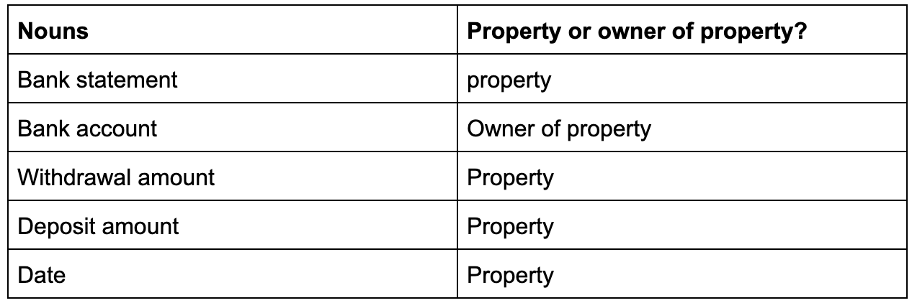
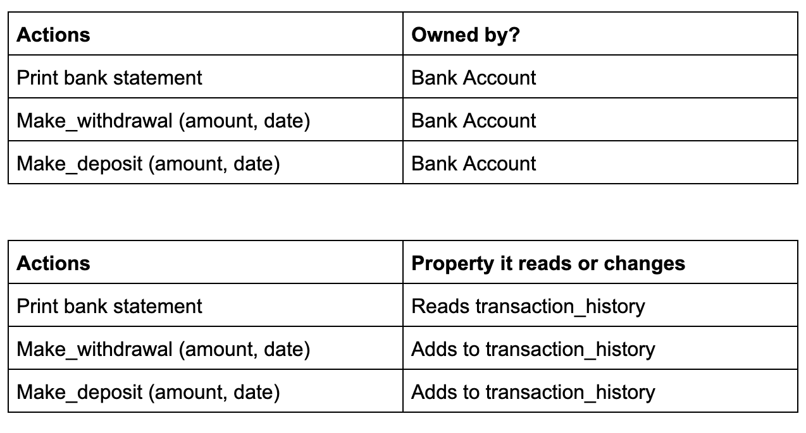
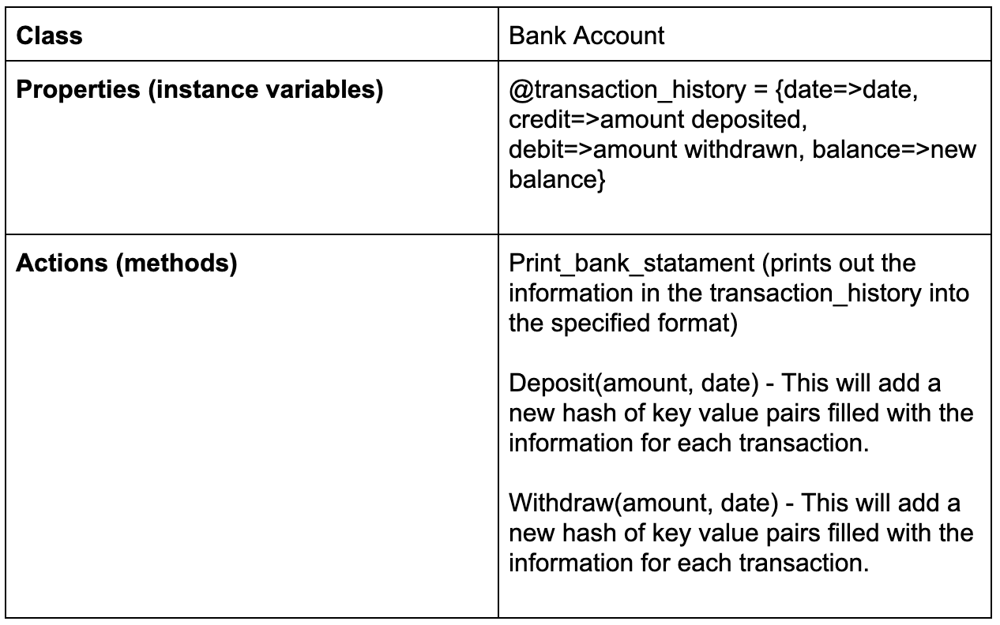
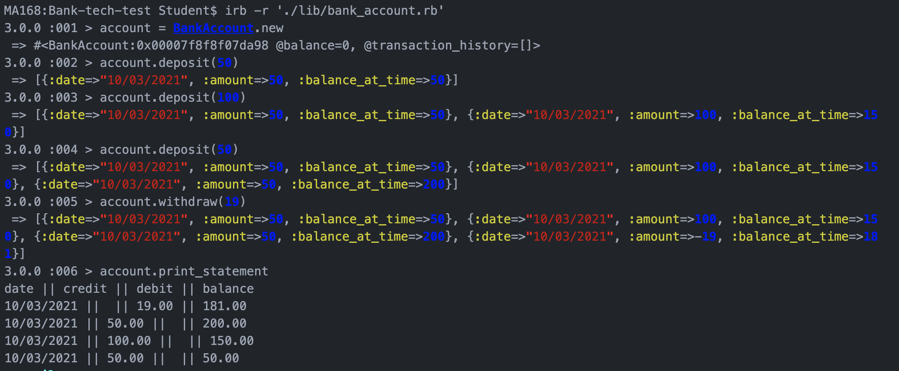

# Specification

* You should be able to interact with your code via a REPL like IRB or the JavaScript console. (You don't need to implement a command line interface that takes input from STDIN.)
* Deposits, withdrawal.
* Account statement (date, amount, balance) printing.
* Data can be kept in memory (it doesn't need to be stored to a database or anything).

# Project Set Up

* Clone this repo
* Run `bundle install`
* Run on IRB using `irb -r "./lib/bank_account"`
* Run `rspec` to run unit tests
* Run `rubocop` for linter check

# Planning

 Acceptance Criteria broken into user stories

```
As a bank customer
So that i can view my transaction history
I want to be able to print my bank statement
```

```
As a bank customer
So that i can keep my money in one place
I want to be able to make a deposit to my bank account
```

```
As a bank customer
So that i can spend my money
I want to be able to make a withdrawal from my bank account
```

```
As a bank customer
So that i can see my how much and when i have withdrawn money
I want to be able to view the date and amount of a withdrawal on my bank statement
```

```
As a bank customer
So that i can see my how much and when I have deposited money
I want to be able to view the date and amount of a deposit on my bank statement
```

 User stories used to create a class diagram





# Screenshot of code working in IRB




# Next Steps
* Class Extractions - my next step would be to extract bank_account.rb in to the following classes:
COMPLETED
    - statement.rb: This class would handle the rendering of the bank transactions into a printable statement. It would require the instance variable transactions_history passed as an argument to be rendered
TO DO
    - transactions.rb: This class would handle creating a new deposit or withdraw transaction.


# Edge Cases
ACCOUNTED FOR:
* User cannot withdraw more than the current balance, if so a message warns them of insufficient funds.
* User can not print a statement if no transactions have been made.
* A bank account is always initialised with a balance of 0.

TO ADD:
* Throw an error when no amount is added to a withdraw or deposit transaction
* Throw an error when a negative number chose as an amount for the deposit transaction
* Add an overdraft - where a customer is allowed to withdraw more than the balance
